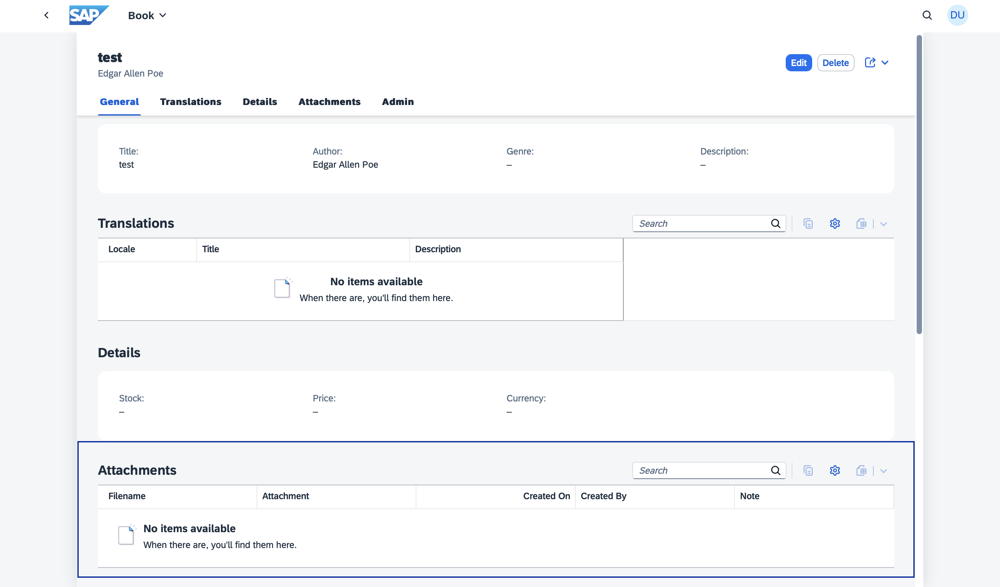
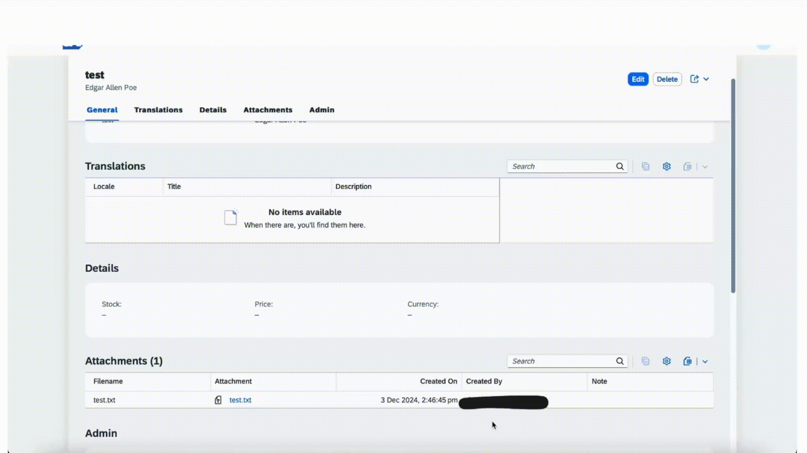

[](https://api.reuse.software/info/github.com/cap-java/sdm)

# CAP plugin for SAP Document Management Service
The `com.sap.cds:sdm` dependency is a [CAP Java plugin](https://cap.cloud.sap/docs/java/building-plugins) that provides an easy CAP-level integration with [SAP Document Management Service](https://discovery-center.cloud.sap/serviceCatalog/document-management-service-integration-option). This package supports handling of attachments(documents) by using an aspect Attachments in SAP Document Management Service.  
This plugin can be consumed by the CAP application deployed on BTP to store their documents in the form of attachments in Document Management Repository.

## Key features

- Create attachment : Provides the capability to upload new attachments.
- Read attachment : Provides the capability to preview attachments.
- Delete attachment : Provides the capability to remove attachments.
- Rename attachment : Provides the capability to rename attachments.
- Virus scanning : Provides the capability to support virus scan for virus scan enabled repositories.
- Draft functionality : Provides the capability of working with draft attachments.
- Display attachments specific to repository: Lists attachments contained in the repository that is configured with the CAP application.

## Table of Contents

- [Pre-Requisites](#pre-requisites)
- [Setup](#setup)
- [Deploying and testing the application](#deploying-and-testing-the-application)
- [Use com.sap.cds:sdm dependency](#use-comsapcdssdm-dependency)
- [Known Restrictions](#known-restrictions)
- [Support, Feedback, Contributing](#support-feedback-contributing)
- [Code of Conduct](#code-of-conduct)
- [Licensing](#licensing)

## Pre-Requisites
* Java 17 or higher
* [MTAR builder](https://www.npmjs.com/package/mbt) (`npm install -g mbt`)
* [Cloud Foundry CLI](https://docs.cloudfoundry.org/cf-cli/install-go-cli.html), Install cf-cli and run command `cf install-plugin multiapps`
* UI5 version 1.131.0 or higher

> **cds-services**
>
> The behaviour of clicking attachment and previewing it varies based on the version of cds-services used by the CAP application. 
>
> - For cds-services version >= 3.4.0, clicking on attachment will
>   - open the file in new browser tab, if browser supports the file type.
>   - download the file to the computer, if browser does not support the file type.
>
> - For cds-services version < 3.4.0, clicking on attachment will download the file to the computer
>
> A reference to adding this can be found [here](https://github.com/cap-java/sdm/blob/691c329f4c3c17ae390cfcb2db1ef02650585aee/cap-notebook/demoapp/pom.xml#L20)

## Setup

In this guide, we use the Bookshop sample app in the [deploy branch](https://github.com/cap-java/sdm/tree/deploy) of this repository, to integrate SDM CAP plugin.  Follow the steps in this section for a quick way to deploy and test the plugin without needing to create your own custom CAP application.

### Using the released version
If you want to use the version of SDM CAP plugin released on the central maven repository follow the below steps:

1. Remove the sdm and sdm-root folders from your local .m2 repository. This ensures that the CAP application uses the plugin version from the central Maven repository, as the local .m2 repository is prioritized during the build process.

2. Clone the sdm repository:

```sh
   git clone https://github.com/cap-java/sdm
```

3. Checkout to the branch **deploy**:

```sh
   git checkout deploy
```

4. Navigate to the demoapp folder:

```sh
   cd cap-notebook/demoapp
```

5. Configure the [REPOSITORY_ID](https://github.com/cap-java/sdm/blob/4180e501ecd792770174aa4972b06aff54ac139d/cap-notebook/demoapp/mta.yaml#L21) with the repository you want to use for deploying the application. Set the SDM instance name to match the SAP Document Management integration option instance you created in BTP and update this in the mta.yaml file under the [srv module](https://github.com/cap-java/sdm/blob/4180e501ecd792770174aa4972b06aff54ac139d/cap-notebook/demoapp/mta.yaml#L31) and the [resources section](https://github.com/cap-java/sdm/blob/4180e501ecd792770174aa4972b06aff54ac139d/cap-notebook/demoapp/mta.yaml#L98) values in the **mta.yaml**. 

6. Build the application:

```sh
   mbt build
```
Now the application will pick the released version of the plugin from the central maven repository as the dependency is added in the [pom.xml](https://github.com/cap-java/sdm/blob/4180e501ecd792770174aa4972b06aff54ac139d/cap-notebook/demoapp/srv/pom.xml#L18)

7. Log in to Cloud Foundry space:

```sh
   cf login -a <CF-API> -o <ORG-NAME> -s <SPACE-NAME>
```
8. Deploy the application:

```sh
   cf deploy mta_archives/*.mtar
```

### Using the development version
To use a development version of the SDM CAP plugin, follow these steps. This is useful if you want to test changes made in a separate branch of this github repository or use a version not yet released on the central Maven repository.

1. Clone the sdm repository:

```sh
   git clone https://github.com/cap-java/sdm
```
2. Install the plugin in the root folder after switiching to the branch you want to use:

```sh
   mvn clean install
```
The plugin is now added to your local .m2 repository, giving it priority over the version available in the central Maven repository during the application build.

3. Checkout to the branch **deploy**:

```sh
   git checkout deploy
```

4. Navigate to the demoapp folder:

```sh
   cd cap-notebook/demoapp
```

5. Configure the [REPOSITORY_ID](https://github.com/cap-java/sdm/blob/4180e501ecd792770174aa4972b06aff54ac139d/cap-notebook/demoapp/mta.yaml#L21) with the repository you want to use for deploying the application. Set the SDM instance name to match the SAP Document Management integration option instance you created in BTP and update this in the mta.yaml file under the [srv module](https://github.com/cap-java/sdm/blob/4180e501ecd792770174aa4972b06aff54ac139d/cap-notebook/demoapp/mta.yaml#L31) and the [resources section](https://github.com/cap-java/sdm/blob/4180e501ecd792770174aa4972b06aff54ac139d/cap-notebook/demoapp/mta.yaml#L98) values in the **mta.yaml**. 

6. Build the application:

```sh
   mbt build
```
7. Log in to Cloud Foundry space:

```sh
   cf login -a <CF-API> -o <ORG-NAME> -s <SPACE-NAME>
```
8. Deploy the application:

```sh
   cf deploy mta_archives/*.mtar
```

## Use com.sap.cds:sdm dependency
Follow these steps if you want to integrate the SDM CAP Plugin with your own CAP application. 

1. Add the following dependency in pom.xml in the srv folder
   
   ```sh
   <dependency>
      <groupId>com.sap.cds</groupId>
      <artifactId>sdm</artifactId>
      <version>{version}</version>
   </dependency>
   ```
   
2. To use sdm plugin in your CAP application, create an element with an `Attachments` type. Following the [best practice of separation of concerns](https://cap.cloud.sap/docs/guides/domain-modeling#separation-of-concerns), create a separate file _srv/attachment-extension.cds_ and extend your entity with attachments. Refer the following example from a sample Bookshop app:

   ```
   using {my.bookshop.Books } from '../db/books';
   using {sap.attachments.Attachments} from`com.sap.cds/sdm`;
   
   extend entity Books with {
      attachments : Composition of many Attachments;
   }
   ```

3. Create a SAP Document Management Integration Option [Service instance and key](https://help.sap.com/docs/document-management-service/sap-document-management-service/creating-service-instance-and-service-key). Bind your CAP application to this SDM instance. Add the details of this instance to the resources section in the `mta.yaml` of your CAP application. Refer the following example from a sample Bookshop app.

   ```
   modules:
      - name: bookshop-srv
      type: java
      path: srv
      requires:
         - name: sdm-di-instance
  
   resources:
      - name: sdm-di-instance
      type: org.cloudfoundry.managed-service
      parameters:
         service: sdm
         service-plan: standard
   ```

4. Using the created SDM instance's credentials from key [onboard a repository](https://help.sap.com/docs/document-management-service/sap-document-management-service/onboarding-repository). In mta.yaml, under properties of the srv module add the repository id. Refer the following example from a sample Bookshop app. Currently only non versioned repositories are supported. 

    ```
    modules:
      - name: bookshop-srv
      type: java
      path: srv
      properties:
            REPOSITORY_ID: <REPO ID>
      requires:
         - name: sdm-di-instance
    ```

5. Add the following facet in _fiori-service.cds_ in the _app_ folder. Refer the following [example](https://github.com/cap-java/sdm/blob/16c1b17d521a141ef1b1adfbed1e06c5bf7a980f/cap-notebook/demoapp/app/admin-books/fiori-service.cds#L24) from a sample Bookshop app.
   ```sh
      {
         $Type : 'UI.ReferenceFacet',
         ID     : 'AttachmentsFacet',
         Label : '{i18n>attachments}',
         Target: 'attachments/@UI.LineItem'
      }
   ```

## Deploying and testing the application

1. Log in to Cloud Foundry space:

   ```sh
   cf login -a <CF-API> -o <ORG-NAME> -s <SPACE-NAME>
   ```

2. Build the project by running following command from root folder of your CAP application
   ```sh
   mbt build
   ```
   Above step will generate .mtar file inside mta_archives folder.

3. Deploy the application
   ```sh
   cf deploy mta_archives/*.mtar
   ```

4. Go to your BTP subaccount and launch your application.

5. The `Attachments` type has generated an out-of-the-box Attachments table (see highlighted box) at the bottom of the Object page:

   

6. **Upload a file** by going into Edit mode by using the **Upload** button on the Attachments table. The file is then stored in SAP Document Management Integration Option. We demonstrate this by uploading a TXT file:

   

7. **Open a file** by clicking on the attachment. We demonstrate this by opening the previously uploaded TXT file:

   

8. **Rename a file** by going into Edit mode and setting a new name for the file in the filename field. Then click the **Save** button to have that file renamed in SAP Document Management Integration Option. We demonstrate this by renaming the previously uploaded TXT file: 

   

9. **Delete a file** by going into Edit mode and selecting the file(s) and by using the **Delete** button on the Attachments table. Then click the **Save** button to have that file deleted from the resource (SAP Document Management Integration Option). We demonstrate this by deleting the previously uploaded TXT file:

   

## Known Restrictions

- Repository : This plugin does not support the use of versioned repositories.
- File size : Attachments are limited to a maximum size of 700 MB.

## Support, Feedback, Contributing

This project is open to feature requests/suggestions, bug reports etc. via [GitHub issues](https://github.com/cap-java/sdm/issues). Contribution and feedback are encouraged and always welcome. For more information about how to contribute, the project structure, as well as additional contribution information, see our [Contribution Guidelines](CONTRIBUTING.md).

## Code of Conduct

We as members, contributors, and leaders pledge to make participation in our community a harassment-free experience for everyone. By participating in this project, you agree to abide by its [Code of Conduct](CODE_OF_CONDUCT.md) at all times.

## Licensing

Copyright 2024 SAP SE or an SAP affiliate company and <your-project> contributors. Please see our [LICENSE](LICENSE) for copyright and license information. Detailed information including third-party components and their licensing/copyright information is available [via the REUSE tool](https://api.reuse.software/info/github.com/cap-java/sdm).

